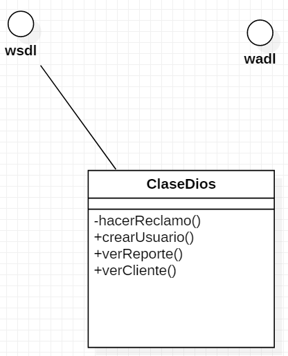

# *GOTA (THE BLOB)*

<strong>Nombres Alternativos:</strong> Clase Dios,  Winnebago  

<strong>Sinopsis:</strong> Consiste en una clase o módulo que monopoliza las responsabilidades de la aplicación. Creando un programa en el que se evidencia una gran cantidad de líneas, sin una adecuada delegación entre clases. Es por esto que mientras hay una clase omnipotente que se ejecuta la mitad del programa, mientras que la mayoría de los demás objetos solo contienen datos o ejecutan procesos simples.

<strong>Causas Raíces:</strong> Realizar un código con prisa, la pereza, y la influencia de un diseño procedural.

<strong>Consecuencias:</strong> Se presenta un código desorganizado y fuertemente interdependendiente.

<strong>Solucion:</strong> La solución incluye
refactoring para la distribución de responsabilidades logrando así el aislamiento de los
efectos de cambio.
<strong>Fuerzas desequilibradas:</strong> Gestión de la funcionalidad, el rendimiento y la complejidad

### *DIAGRAMA UML*

#### <strong>Origen del Nombre:</strong>
El nombre de este patrón viene de una película en la que un gran monstruo al comerse a cada víctima va aumentando de tamaño, tanto así que amenaza con destruir al mundo con su gran tamaño. 

La película es una buena analogía por que este patrón consume arquitecturas enteras orientadas a objetos.

#### <strong>Síntomas y Consecuencias</strong>
* Suele verse presente en una clase que lleve una vastta cantidad de atributos y métodos, o ambos.
Una clase con 60 o más atributos y métodos usualmente indica la presencia de este anti-patrón.
* Una falta de cohesión de los atributos y operaciones hace evidenciar este patrón. Una colección dispar de atributos y operaciones no relacionados y encapsulados en una sola clase.
* Una simple clase controladora con muchas asociaciones.
* Ausencia del paradigma de Programación Orientada a Objetos, así mismo no se evidencia una modularidad y un encapsulamiento. Limitando a casi nula las ventajas que tiene el paradigma, y por esto al no cumplir con el principio de Abierto/ Cerrado, al momento de querer editar una clase, se termina editando todo el software.
* Se vuelve inutilizable.
* Consume memoria en exceso.

#### <strong>Típicas Causas</strong>
* Falta de una arquitectura orientada a objetos.  Probablemente quien diseño la arquitectura no tiene los adecuados conocimientos para entender los principios de una arquitectura orientada a objetos. Alternativamente el equipo puede tener debilidad en habilidades de abstracción.
* En proyectos iterativos, los desarrolladores tienden a agregar pequeñas piezas de funcionalidad a las clases existentes, en lugar de agregar nuevas clases, o revisar y refactorizar la jerarquía de clases para una asignación de responsabilidades más efectiva.
* Desastre ya especificado. A veces, el anti-patrón resulta de la forma en que se especifican los requisitos. Si los requisitos dictan una solución de tipo procedimental, entonces se pueden hacer compromisos arquitectónicos durante el análisis de requisitos que son difíciles de cambiar. Definir la arquitectura del sistema como parte del análisis de requisitos suele ser inapropiado.

#### <strong>Solución Refactorizada:</strong>
 La clave es separar el comportamiento del God Class. Puede ser apropiado reasignar el comportamiento y la responsabilidad a algunos de los objetos de datos encapsulados de forma que estos objetos sean más independiente y la God Class menos compleja.

